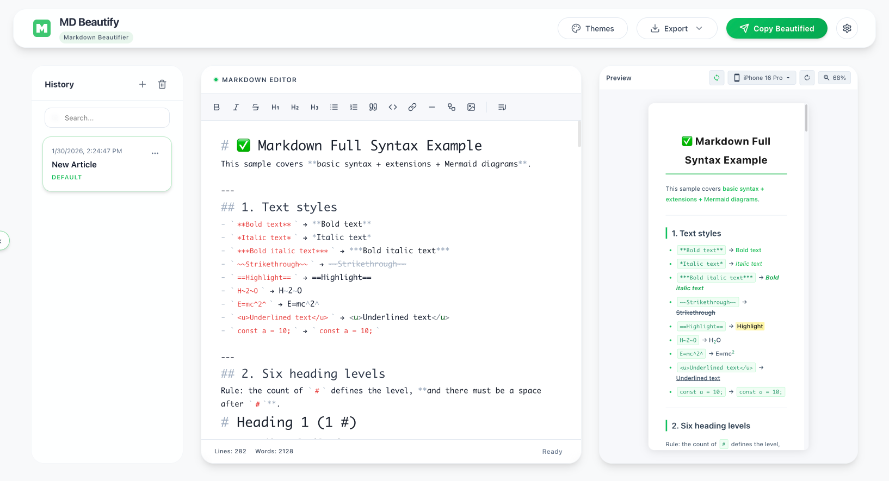

<p align="center">
  
</p>

<h1 align="center">MD Beautify</h1>

<h4 align="center">
  This project is a comprehensive refactor and upgrade based on the WeMD project developed by @tenngoxars, now renamed to MD Beautify.
  Special thanks again to @tenngoxars.
</h4>
<p align="center">
  <strong>A more elegant Markdown beautification and typesetting tool</strong>
</p>

<p align="center">
  Say goodbye to dull styles. Focus on Markdown writing, render and beautify with one click, and copy with HTML formatting.<br>
  A <b>local-first</b>, <b>privacy-secure</b> Markdown rendering tool designed specifically for content creators.<br>
  Built-in 10+ exquisite themes | Obsidian plugin support | One-click image upload
</p>

<p align="center">
  <a href="README_zh.md">简体中文</a> •
  <a href="https://github.com/qingu-x/md-beautify">🌐 Project Homepage</a> •
  <a href="https://github.com/qingu-x/md-beautify/releases">📦 Download Desktop Version</a> •
  <a href="https://github.com/qingu-x/obsidian-md-beautify-plugin">Obsidian Plugin</a>
</p>

<p align="center">
  <a href="LICENSE"></a>
  
  
  
  
</p>

---

## ✨ Features

|     | Feature                    | Description                                                                              |
| --- | -------------------------- | ---------------------------------------------------------------------------------------- |
| 📝  | **Full Markdown Support**  | Supports GFM, tables, code highlighting, math formulas, and Mermaid charts               |
| 🎨  | **Beautiful Themes**       | Built-in professional themes, supports visual designer or custom CSS                     |
| 📋  | **One-click Copy**         | Copy with HTML formatting, perfectly adapted to various rich text editors, WYSIWYG       |
| 🖼️  | **Auto Image Upload**      | Batch upload local images to the cloud (supports Qiniu, Ali, Tencent, S3, etc.)          |
| 💾  | **Data Privacy**           | Local-first storage, no login required, all data stays in your browser or local machine  |
| 📱  | **Multi-platform**         | Web + Desktop (macOS / Windows / Linux) + Obsidian Plugin                                |
| 🌙  | **Dark Mode Support**      | Perfectly adapted for both light and dark modes, including interface and content preview |
| 👁️  | **High-precision Preview** | Exclusive color preservation algorithm, high-fidelity dark mode rendering effects        |
| 🎞️  | **Interactive Components** | Supports sliding image groups and interactive cards to enrich Markdown visual expression |

---

## 🌟 Why Choose MD Beautify?

- **Ultimate Beautification**: Built-in carefully designed themes to solve the issue of plain Markdown styles.
- **Copy with Formatting**: Rendered content can be copied directly with HTML styles, perfect for pasting into emails, notes, blogs, etc.
- **Privacy First**: No user information collected, no intermediate servers, images uploaded directly from local to your private cloud.
- **Highly Customizable**: Design your own exclusive rendering themes with the built-in visual editor, no coding required.

---

## 💡 Technical Highlights

### High-precision Color Preservation Algorithm

MD Beautify uses a **Color Semantic Preservation Algorithm** based on WeMD, providing high-fidelity previews of different themes in dark mode within the editor, achieving over **98% fidelity**.

> This algorithm aims to provide the closest result to native rendering while ensuring high-performance CSS conversion.

- Intelligent identification and optimization of different element types
- HSL color space calculation to ensure visual consistency

👉 **[View Algorithm Source](packages/core/src/wechatDarkMode.ts)**

---

## 🚀 Quick Start

### Online Usage

Run the Web version locally to start writing immediately, no installation required, supporting pure local storage.

### Desktop Version Download

Go to [Releases](https://github.com/qingu-x/md-beautify/releases) to download the installer for your platform:

- **macOS**: `.dmg` (Intel) / `-arm64.dmg` (Apple Silicon)
- **Windows**: `.exe`
- **Linux**: `.AppImage`

> ⚠️ **macOS Users**: If you see "App is damaged" when opening for the first time, run the following in terminal:
>
> ```bash
> xattr -cr /Applications/MDBeautify.app
> ```
>
> ⚠️ **Windows Users**: If SmartScreen says "Unknown Publisher", click "More Info" -> "Run anyway"
>
> ⚠️ **Linux Users**: Set executable permission before running: `chmod +x MDBeautify.AppImage`

### Docker Deployment

```bash
# If you have Docker Desktop (Mac/Win) installed:
docker compose up -d

# If you use docker-compose:
docker-compose up -d
```

Visit `http://localhost:8080` to start using it.

---

## 🛠️ Local Development

### Prerequisites

- Node.js ≥ 18
- pnpm ≥ 9 (Recommend `corepack enable pnpm`)

### Installation & Running

```bash
# Install dependencies
pnpm install

# Start Web development server
pnpm dev:web

# Start Desktop (Web must be running first)
pnpm dev:desktop
```

### Build

```bash
# Build Web
pnpm --filter @mdb/web build

# Build Desktop App
pnpm --filter mdb-electron run build:mac  # macOS
pnpm --filter mdb-electron run build:win  # Windows
```

---

## 📁 Project Structure

```
MDB/
├── apps/
│   ├── web/        # Vue + Vite Frontend
│   ├── electron/   # Electron Desktop
│   └── server/     # NestJS Image Upload Service
├── packages/
│   └── core/       # Markdown Parsing / Themes / Utils
├── templates/      # Theme CSS Templates
└── turbo.json      # Turborepo Config
```

---

## 📸 Screenshots



---

## 💬 Feedback

If you have questions or suggestions, please submit an [Issue](https://github.com/qingu-x/md-beautify/issues).

If you find this project helpful, you can buy me a coffee!

[](https://www.buymeacoffee.com/pax_z)

---

## 🤝 Acknowledgments

The dark mode preview algorithm in this project is deeply inspired by the core logic of [wechatjs/mp-darkmode](https://github.com/wechatjs/mp-darkmode) open-sourced by the WeChat team. Thanks to the WeChat team for providing excellent solutions for developers!

---

## 📄 License

[MIT](LICENSE) © MDBeautify Team

Special thanks again to [@tenngoxars](https://github.com/tenngoxars) and the WeMD Team for the original project. This project is also open-sourced under the MIT license.
